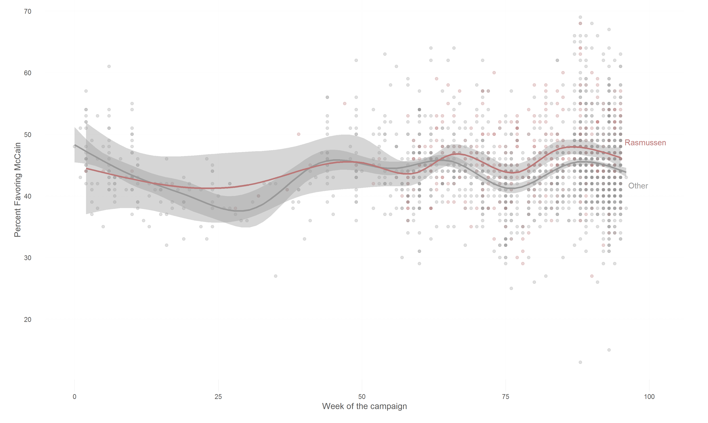

## The House Always Wins: House Effects in Polling

### Preface
In 2007--2008, I collected some data to estimate house 'effects', and to explain them. For instance, some variation across polling houses likely stems from the whether or not a 'don't know' option is provided, the length of the polling period, whether or not the polling house uses a likely or registered voter screen, the question text,  etc. 

This repository includes some of the data I collected, and may over time include some of the analyses I conducted.

### Rasmussen Vs. the Rest

**G. W. Bush Approval**

**2008 Election Cycle, McCain Support**

### Data

**Preliminary Release**

* [G. W. Bush Approval Ratings](data/bushfav_merged.csv)
    - From [PollingReport.com](PollingReport.com) among other other places.
* [2008 Elections polling data](data/collapsed polls_pollster.csv)
    - From [pollster.com](pollster.com)
 
### Scripts

**Preliminary Release**

* [Rasmussen Vs. Rest](scripts/rasmussen_vs_all.R)
* Kalman Filtering

#### Contribute to the project

If you see an inconsistency in the data, or have a suggestion, or some data that you would like to contribute to the project, please create a pull request or open an issue. 

### License

Released under [CC BY 2.0](https://creativecommons.org/licenses/by/2.0/). 
